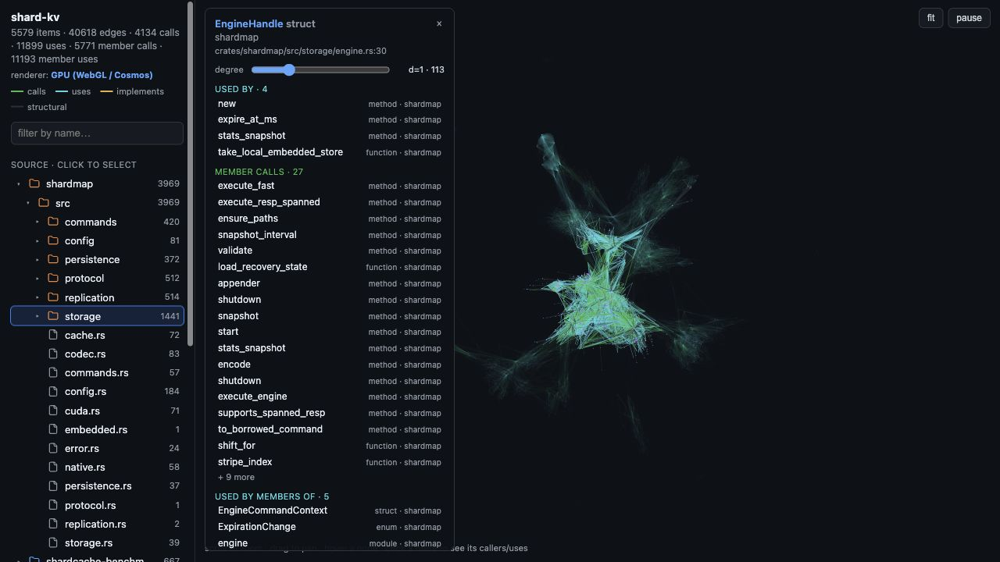

# build-graph

Keep Rust **`ARCHITECTURE.md` files accurate** with a code graph built from the compiler's view of your
workspace.

`build-graph` turns a Rust project into:

- an AI-readable architecture snapshot that can be updated in CI,
- a queryable symbol/type/call graph for agents and humans,
- and an offline dashboard for exploring crates, files, folders, symbols, and relationships.

The practical workflow is simple: add the GitHub Action, let it regenerate the graph on a schedule or after code
changes, and review PRs when the generated architecture section changes. Agents can read `ARCHITECTURE.md` first,
then query exact graph edges when they need to navigate the repo without guessing.

Inspired by [graphify](https://github.com/safishamsi/graphify), but where graphify parses *source* with
tree-sitter, this reads what the **compiler actually produced** under `target/`:

- the resolved **crate dependency graph** (`cargo metadata`),
- **source-file membership** (cargo dep-info `.d` files), and
- the full **symbol / type / trait graph** (nightly **rustdoc JSON**).

Because everything comes from the build, every edge is ground truth — there is no LLM and no inference. The output
is a graphify-compatible `graph.json`, so graphify's viewer/MCP tooling works on it too, plus a bundled offline
HTML viewer.

## Dashboard preview



## Editor integrations

Thin shells that run `cargo build-graph watch` and show the live architecture
graph in-editor (they don't duplicate the IDE's own go-to-def / find-usages):

- **VS Code** — [`integrations/vscode`](integrations/vscode) (graph in a side
  panel; compiles, press F5).
- **JetBrains / RustRover** — [`integrations/jetbrains`](integrations/jetbrains)
  (opens the live graph in your browser; builds, run with `./gradlew runIde`).

The live graph also works with no editor plugin at all: `cargo build-graph watch
--driver` plus the bundled HTML viewer / `serve`.

## GitHub Action — keep `ARCHITECTURE.md` fresh

Add this workflow to any Rust repo. It builds the graph, updates the generated section of `ARCHITECTURE.md`, and
commits the doc change only when the graph-derived architecture facts changed.

```yaml
name: Architecture docs

on:
  workflow_dispatch:
  schedule:
    - cron: "0 9 * * 1"

permissions:
  contents: write

jobs:
  architecture:
    runs-on: ubuntu-latest
    steps:
      - uses: actions/checkout@v4

      - uses: d-tietjen/build-graph@master
        with:
          manifest-path: Cargo.toml
          architecture-path: ARCHITECTURE.md

      - name: Commit architecture update
        run: |
          if git diff --quiet -- ARCHITECTURE.md; then
            echo "ARCHITECTURE.md is already current"
            exit 0
          fi
          git config user.name "github-actions[bot]"
          git config user.email "41898282+github-actions[bot]@users.noreply.github.com"
          git add ARCHITECTURE.md
          git commit -m "Update architecture documentation"
          git push
```

The action replaces only the block between `<!-- build-graph:architecture:start -->` and
`<!-- build-graph:architecture:end -->`, so you can keep hand-written or AI-written narrative outside the generated
section. See [docs/github-action.md](docs/github-action.md) for setup options, PR-based workflows, and how to tell
agents to use the generated doc.

## Two ways to use it

### 1. Automatic — refresh on every `cargo build` (build dependency)

Add the build helper and a three-line `build.rs` to any crate you want graphed:

```toml
# Cargo.toml
[build-dependencies]
build-graph = "0.2.0"
```

```rust
// build.rs
fn main() {
    build_graph::Builder::new().run();
}
```

Now every `cargo build` writes `target/build-graph/graph.json` (+ `graph.html`, `GRAPH_REPORT.md`). Cargo only
re-runs a crate's build script when that crate changes, so the graph updates **incrementally** for free. Add the
helper to several workspace members and their fragments merge into one graph.

This path is deliberately lightweight (no `cargo`/toolchain invocation from inside the build — it can't deadlock)
and produces the **Layer 1** graph: crates, source files, and `depends_on` edges. For the rich symbol layer, use
the CLI below. Set `BUILD_GRAPH=0` to disable; build-script errors never fail your build.

### 2. On demand — the `cargo build-graph` CLI

```bash
cargo install build-graph     # installs `cargo-build-graph`, invoked as `cargo build-graph`

cargo build-graph build        # run `cargo build`, then refresh the graph from target/
cargo build-graph watch        # rebuild + refresh on every save (incremental; Ctrl-C to stop)
cargo build-graph update       # refresh from the current target/ without building
cargo build-graph view         # open the bundled HTML viewer
cargo build-graph build --rich # also add the nightly rustdoc symbol/type layer (Layer 2)
cargo build-graph build --rich --references     # + semantic call/use edges via rust-analyzer (Layer 3)
cargo build-graph context <name> # one-shot: a symbol's location, counts + top callers/uses/impls
cargo build-graph find <name>  # locate symbols + counts (or `--at FILE:LINE` reverse lookup)
cargo build-graph refs <name>  # expand one symbol's relationships (bounded, filterable, `--depth N`)
cargo build-graph serve        # load the graph once + serve queries; find/refs/context auto-use it
```

Useful flags: `--manifest-path`, `--target-dir`, `--out <dir>`, `-p <crate>` (scope), `--release`,
`--nightly <toolchain>`, `--no-derives` (drop derive-generated impls), `--references` (Layer 3, below).

## The layers

| Layer | Source | Toolchain | Nodes | Edges |
|-------|--------|-----------|-------|-------|
| **1** (always) | `cargo metadata` + dep-info `.d` | **stable** | crates, source files | `depends_on`, `contains` |
| **2** (`--rich`) | nightly **rustdoc JSON** | **nightly** | modules, structs, enums, traits, fns, methods, fields, type aliases, consts, statics | `implements`, `has_field`, `has_method`, `has_variant`, `takes`, `returns`, `uses_type`, `aliases` |
| **3** (`--references`) | **rust-analyzer** (SCIP index) | stable | — (connects Layer-2 items) | `calls`, `uses`, plus owner rollups `member_calls`, `member_uses` — **semantic** |

Layer 2 items carry `source_file:line` and link up to their Layer-1 crate node; cross-crate type references
resolve to other workspace crate nodes, so the layers form one connected graph.

### Layer 3 — function- and object-level references (`--references`)

rustdoc only sees *signatures*, so Layer 2 stops at the type level. Layer 3 reaches into function **bodies** for
the reference graph that makes "find every use/caller of this symbol" work — and it uses **rust-analyzer** to get
it right. The tool runs `rust-analyzer scip` over the workspace, parses the resulting index, maps each symbol to
its Layer-2 node, attributes every reference to its enclosing function, and emits a `calls` edge (target is a
fn/method) or a `uses` edge (target is a type/const/static/macro/field/variant/etc.).

Those exact function-level references are also rolled up through the Layer-2 ownership graph. If a method on
`Widget` calls `paint` and uses `Color`, the graph keeps the direct method edges and adds `Widget -> paint`
(`member_calls`) and `Widget -> Color` (`member_uses`). The same rollup works for structs, enums, traits,
variants, unions, and modules, so clicking an object-like node in the viewer shows the relationships made by the
code inside it.

Why rust-analyzer and not the build artifacts? Because for *this* purpose — what the source actually references —
the semantic resolution is what matters, and it's what object-file or syntactic approaches get wrong: it resolves
**method calls**, **dyn-dispatch** calls (`a.method()` on a `&dyn Trait`), calls **inside `async fn`s** (which
object code files under the generated future, not the source fn), and field/const/type uses — completely.

rust-analyzer needs to be installed (`rustup component add rust-analyzer`); if it's absent, the layer is
**skipped with a message** (we'd rather not offer the feature than emit inaccurate edges). The index is
whole-workspace, so `--references` re-runs it only when something changed. `--references` implies `--rich`.

#### Alternative backend — the rustc driver (`--driver-bin`, experimental)

`rust-analyzer scip` is a **cold, whole-workspace** index: any change re-runs the whole thing (minutes to tens of
minutes on a large workspace). The alternative is a clippy-style **rustc driver** that reads the compiler's HIR
during a normal `cargo check`, so it is **incremental for free** — cargo only re-runs it for the crates it
recompiles. It's a build-time **Cargo feature** (the driver is a separate nightly `rustc_private` crate); enable it
and turn it on per run with `--driver`:

```bash
cargo install build-graph --features rustc-driver
cargo build-graph build --driver
cargo build-graph watch --driver
```

(`cargo build --features rustc-driver` instead of `install` for a local build;
`build` produces the graph once, `watch` refreshes it incrementally on every save.)

`--driver` builds the driver crate ([`crates/bg-driver`](crates/bg-driver), pinned to the right nightly) on demand
the first time (cargo caches it after); pass `--driver-bin <path>` to use a prebuilt binary, or set
`BUILD_GRAPH_DRIVER`. It replaces the scip pass: runs `cargo check --all-targets` with the driver as
`RUSTC_WORKSPACE_WRAPPER`, persists per-crate edge files (keyed by cargo's stable metadata hash) under
`<out>/driver-refs`, and maps them onto the Layer-2 nodes.

On a benchmark workspace (108 crates) it was ~7× faster cold and orders of magnitude faster per edit. Its
resolution is validated against ground truth, but it is **not** byte-identical to rust-analyzer (it indexes the
semantic def-reference graph, not rust-analyzer's syntactic occurrence graph — e.g. it sees through `use` imports
and omits item-level type decls that Layer 2 already covers). Treat it as a faster, compiler-grounded reference
source rather than a drop-in rust-analyzer clone.

### Nightly + rustdoc-types pin

rustdoc's JSON format is unstable and versioned. This repo pins `rustdoc-types = "0.57"`
(`FORMAT_VERSION = 57`), which matches **`nightly-2026-02-27`**. The CLI checks the emitted `format_version`
against the pinned one and fails with a clear message on mismatch — pass `--nightly <toolchain>` to select a
matching nightly, or bump the `rustdoc-types` dependency. Layer 1 never needs nightly, so the tool is always
useful even if Layer 2 is off.

## Output

Written to `target/build-graph/` (or `--out`):

- **`graph.json.gz`** — the graph data, gzip-compressed by default (~35× smaller than raw JSON on a large
  workspace). graphify-compatible (`nodes`/`edges`/`hyperedges`); deterministic, path-derived IDs so it diffs
  cleanly across builds; every edge is `EXTRACTED`, `confidence_score: 1.0`. Pass **`--no-compress`** to write a
  plain **`graph.json`** instead (handy for `jq` or graphify's MCP server). Every command reads either form
  transparently — the format is detected by content (gzip magic bytes), not the extension — so you can switch
  freely and an incremental rebuild reloads the prior graph regardless.
- **`graph.html`** — force-directed viewer. Small graphs inline their data, so the file is self-contained and
  opens straight from `file://`. Large graphs (compact JSON over 32 MiB, e.g. a whole big workspace) are *not*
  inlined — the viewer fetches the data file beside it (`graph.json.gz`, or `graph.json`) and inflates it
  in-browser (`DecompressionStream`), so serve the output dir over HTTP (`cd target/build-graph && python3 -m
  http.server`, then open `http://localhost:8000/graph.html`). The viewer shows this hint if you open such a file
  from `file://`.
- **`GRAPH_REPORT.md`** — counts, largest crates, and the most-connected "god nodes".

The GitHub Action additionally updates `ARCHITECTURE.md` by replacing its generated build-graph block with a
deterministic summary of those artifacts.

Because the graph is graphify-compatible, you can also point graphify's MCP server at a plain `graph.json` — build
with `--no-compress` (or `gunzip -k graph.json.gz`) first: `python3 -m graphify.serve target/build-graph/graph.json`.

## Query the graph — `find` and `refs`

Two commands answer "where is this symbol and what connects to it" — questions text search can't
(*who implements this trait*, *what takes this type*, *which crates use it*, across crate boundaries). The API is
**deliberately bounded**: `find` returns counts so you ask for only the context you need; `refs` returns the
actual edges, capped and filterable.

**`find <name>`** locates symbols and prints metadata + **relationship counts** — never the edges themselves
(a hot type can have thousands):

```bash
cargo build-graph find OperationExecutor          # human-readable
cargo build-graph find Config --kind struct --json # machine-readable, stable shape
```

```
Operation — trait · crate endpoint-types
  src:  endpoints/endpoint-types/src/lib.rs:255
  refs: 2715 total (out 6 · in 2709)
        out: has_method 6
        in:  implements 2708 · contains 1
```

Many matches? It reports `total_matches` vs `returned`; narrow with `--exact`, `--kind`, `--crate`, `--limit`
(default 20, max 100).

**`refs <name|id>`** expands *one* symbol's relationships — **bounded** (default 50, hard cap 200) and
**filterable**, so a huge connection list narrows to the relevant slice:

```bash
cargo build-graph refs Operation --relation implements --crate ep-azure   # who implements it, in one crate
cargo build-graph refs Operation --relation implements --match advisor     # text-search the list down
```

```
Operation — trait · crate endpoint-types  (endpoints/endpoint-types/src/lib.rs:255)
  showing 3 of 855 — narrow with --relation / --crate / --kind / --match, or raise --limit
  implements  <- AdvisorGetRecommendationInput (ep-azure)  endpoints/azure/.../get_recommendation.rs:17
  …
```

`refs` flags: `--relation`, `--incoming`/`--outgoing` (default both), `--match <substr>`, `--kind`, `--crate`,
`--limit`. Pass a node **`id`** from `find` to target a specific symbol when a name is ambiguous. Both commands
locate the graph via `--graph`/`--out`/`--manifest-path` (default `<target>/build-graph/graph.json.gz`, falling
back to `graph.json`); build with `--rich` first — the symbol layer is what they search.

### For AI agents

If the repo has an `ARCHITECTURE.md` generated by the GitHub Action, have the agent read it first. It is a compact,
reviewable map of the current graph: crates, source files, important symbols, and query commands. Then use the graph
queries below when the task needs exact relationships or source locations.

The bounded shape is the point: `find … --json` gives each symbol's `source_file:source_location` and
relationship **counts**, then `refs … --json` returns a capped, filtered slice of edges — so an agent informs
what it looks for and opens exactly the right files instead of grepping or drowning in context. The commands are
plain CLI, so any agent that can run a shell can use them; ready-to-use guidance ships for the common ones:

- **Codex** — copy the body of [`integrations/codex/AGENTS.md`](integrations/codex/AGENTS.md) into your project's
  `AGENTS.md` (or `~/.codex/AGENTS.md` to enable it everywhere). Codex loads `AGENTS.md` before each task and runs
  the CLI through its shell — no plugin needed.
- **Claude Code** — copy the body of [`integrations/claude-code/CLAUDE.md`](integrations/claude-code/CLAUDE.md)
  into your project's `CLAUDE.md`. Claude Code loads it as project memory and runs the same bounded
  `find`/`refs` shell queries — no MCP server or editor extension needed.
- **Any MCP client** — the graph is graphify-compatible, so graphify's MCP server
  (`python3 -m graphify.serve target/build-graph/graph.json`) exposes query tools over it; build with
  `--no-compress` so a plain `graph.json` is on disk, then point your agent's MCP config at it. (A native
  `cargo build-graph` MCP server exposing `find`/`refs` directly is a candidate.)

## Architecture

One published crate, **`build-graph`**, ships two targets:

- **library `build_graph`** — the `[build-dependencies]` helper (`Builder`) plus the graph model,
  deterministic IDs, fragment merge, graphify-compatible output, viewer, and report.
- **binary `cargo-build-graph`** — the `cargo build-graph` CLI (Layer 0 build stream + Layer 1 dep-info +
  Layer 2 rustdoc JSON + Layer 3 references from rust-analyzer SCIP or the opt-in rustc driver), plus the
  `find`/`refs` graph queries and the `view` server.

## Incremental & caching

Both entry points only re-do the crates whose **source files changed**:

- The **CLI** persists the graph plus a `.build-graph-cache.json` beside it. Each run fingerprints every crate by
  its sources' mtimes; unchanged crates are reused from the prior graph, and only dirty crates are re-scanned (and,
  with `--rich`, re-documented). A warm no-op over a 14-crate rich graph (~22k nodes) is ~1s vs ~26s cold; a
  one-crate edit re-documents just that crate (~2s). Cross-crate edges into a re-extracted crate survive (IDs are
  deterministic), and any genuinely dangling edge is pruned before writing.
- The **build-dependency** is incremental by construction: Cargo only re-runs a changed crate's build script, so
  only that crate's fragment is rewritten before the merge.

`cargo build-graph watch` turns this into a hands-free loop: it does one refresh up front, then watches the
workspace's `.rs`/`Cargo.toml` files (skipping `target/`, the output dir, and `.git`) and re-runs the same
incremental refresh whenever they change — a burst of saves coalesces into one rebuild. Pass `--no-build` to only
re-extract from the current `target/` (when your editor already drives the build), `--debounce <ms>` to tune the
settle window, and any `build` flags (`--rich`, `-p`, `--release`, …) to control what each cycle produces.

> **Note on Layer 3 under `watch`:** `--rich --references` still uses rust-analyzer's cold, whole-workspace SCIP
> index, so a reference-heavy watch is only as fast as that re-index. For incremental Layer 3 refreshes, build
> `build-graph` with `--features rustc-driver` and run `cargo build-graph watch --driver`; the driver reads HIR
> during `cargo check`, so cargo re-runs it only for changed crates.

## Limitations / future work

- The build-dependency produces Layer 1 only (a build script can't safely run nightly rustdoc or nested cargo).
- Derive-generated impls (`clone`, `default`, …) add method nodes by default; pass **`--no-derives`** to drop
  every `#[automatically_derived]` impl (its `implements` edge and its methods) from the rich layer.
- rustdoc JSON gives only the *structural* graph (signatures, impls, containment). Body references (`calls`,
  `uses`) and their object-level rollups (`member_calls`, `member_uses`) are added by **Layer 3** via either
  rust-analyzer SCIP (`--references`) or the opt-in compiler HIR driver (`--driver`). Object-file and purely
  syntactic approaches proved too inaccurate for an async codebase (object code files `async fn` calls under the
  generated future, not the source fn; syntactic parsing can't resolve methods). Without one of the Layer 3
  backends, body-level references are simply not produced.

## License

MIT
